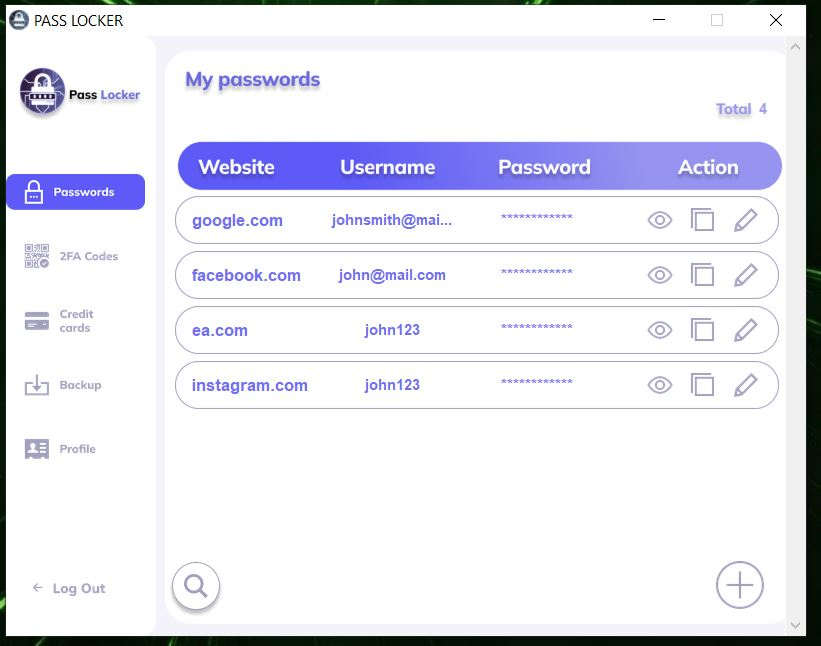
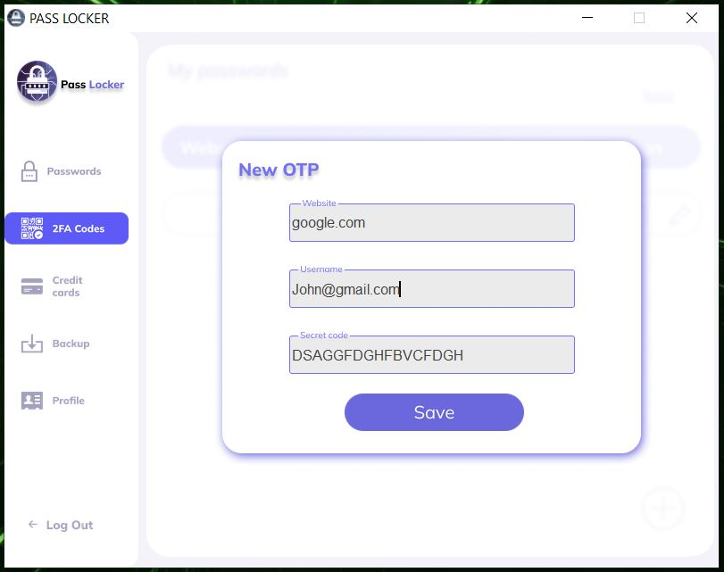
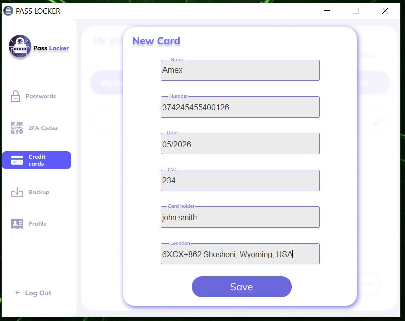

# Python-passLocker
A local secure password manager written fully in python to save passwords, 2fa authentication, credit card
gui built with tkinter

used hashing and salting for master password

used fernet encryption to encrypt the saved passwords using the master password

librairies for encryption:
  1.cryptography
  2.bcrypt

login

view password

add passwords

add OTP for 2FA

add card

view cards

