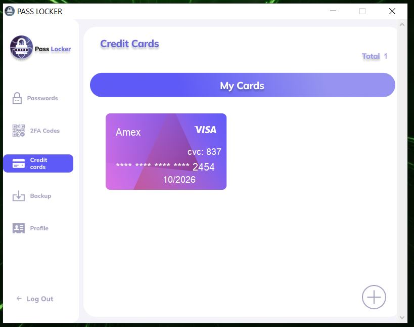

# Python-passLocker
A local secure password manager written fully in python to save passwords, 2fa authentication, credit card

login

view password

add passwords

add OTP for 2FA

add card

view cards

