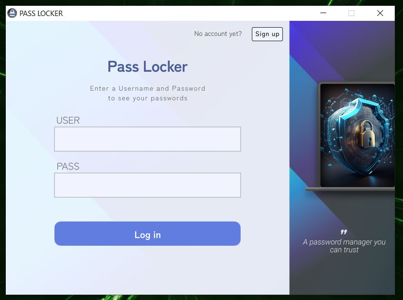
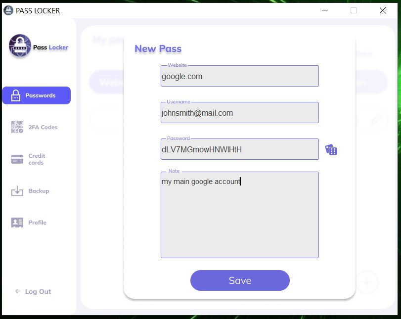

# Python-PassLocker

A **secure, local password manager** built entirely in Python. Python-PassLocker allows you to safely store passwords, manage 2FA OTPs, and save credit card details—all secured with robust encryption. Featuring a user-friendly GUI built with Tkinter, Python-PassLocker is designed to make password management simple and efficient.

---

## 🔒 Key Features

- **Save and manage passwords**  
- **2FA OTP management**  
- **Securely store credit card details**  
- **Generate strong, random passwords**  
- **Quick copy to clipboard** for easy usage  
- **Multi-user support**  
- **Change account information**  

---

## 🛠️ Technologies Used

- **GUI Framework**: Tkinter  
- **Encryption**:  
  - **Fernet Encryption** (via the `cryptography` library) for securing saved passwords.  
  - **Hashing and Salting** (via the `bcrypt` library) for securing the master password.  

---

## 📸 Screenshots

### Login Page  


### View Saved Passwords  


### Add New Passwords  


### Add OTP for 2FA  


### Add Credit Card  


### View Saved Credit Cards  


---

## 🚀 Installation

Follow these steps to set up Python-PassLocker on your local system:

1. **Clone the Repository**
   ```bash
   git clone https://github.com/Ali-Assaad-ss/Python-passLocker.git
   cd Python-passLocker
   ```

2. **Install Dependencies**
   Make sure you have Python 3.8 or higher installed, then run:
   ```bash
   pip install -r requirements.txt
   ```

3. **Run the Application**
   Start the application by running:
   ```bash
   python main.py
   ```

---

## 📝 Usage

1. **Create a Master Account**: Upon first launch, you'll set up a master password to secure all your data.  
2. **Save Credentials**: Add new passwords, OTPs, or credit card details using the intuitive GUI.  
3. **Generate Passwords**: Use the password generator for secure and random passwords.  
4. **Quick Copy**: Easily copy passwords, OTPs, or card details to the clipboard for fast usage.  
5. **Multi-User Support**: Multiple users can securely create and manage their accounts.

---

## 🤝 Contribution Guidelines

Contributions are welcome! Here's how you can help:  

1. **Fork the repository**  
2. **Create a feature branch**  
   ```bash
   git checkout -b feature-name
   ```
3. **Commit your changes**  
   ```bash
   git commit -m "Add feature description"
   ```
4. **Push to the branch**  
   ```bash
   git push origin feature-name
   ```
5. **Submit a pull request**

Please ensure your code follows PEP 8 guidelines and is thoroughly tested before submission.

---

## 🔐 Security

- **Master Password**: Your master password is hashed and salted using `bcrypt`, ensuring it's stored securely.  
- **Data Encryption**: Saved passwords and sensitive data are encrypted using Fernet encryption provided by the `cryptography` library.  

> **Note**: All data is stored locally on your machine. Ensure your device is secure to maintain the integrity of your data.

---

## 📜 License

This project is licensed under the Creative Commons Attribution-NonCommercial 4.0 International License.  
You are free to share, copy, and redistribute the material in any medium or format, under the following conditions:  
- **Attribution**: You must give appropriate credit, provide a link to the license, and indicate if changes were made.  
- **NonCommercial**: You may not use the material for commercial purposes.  
Full details: https://creativecommons.org/licenses/by-nc/4.0/

---

## 🌟 Acknowledgements

Special thanks to the developers and maintainers of the following libraries:
- [`cryptography`](https://github.com/pyca/cryptography)  
- [`bcrypt`](https://github.com/pyca/bcrypt)  

---

## 📧 Contact

If you have any questions, suggestions, or issues, feel free to open an [issue](https://github.com/Ali-Assaad-ss/Python-passLocker/issues) or reach out via email: ali.al.assaad.ss@gmail.com.
